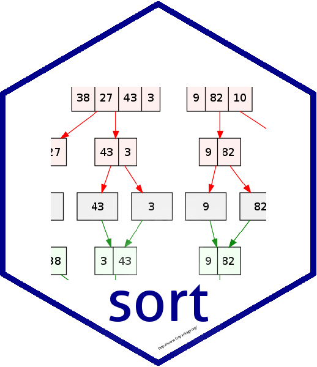

---
output:
  github_document
editor_options: 
  chunk_output_type: console
---

<!-- README.md is generated from README.Rmd. Please edit that file -->

```{r, echo = FALSE}
knitr::opts_chunk$set(
  collapse = TRUE,
  comment = "#>",
  fig.path = "README-"
)
```



[](https://travis-ci.org/MarcusKlik/sort)
[](https://ci.appveyor.com/project/MarcusKlik/sort)
[](https://www.gnu.org/licenses/agpl-3.0)
[](https://www.tidyverse.org/lifecycle/#experimental)
[](https://codecov.io/gh/fstpackage/sort)

## Overview

```{r, echo = FALSE}
set.seed(87617)
```

The `sort` package provides very fast multi-threaded sorting of R vectors.
